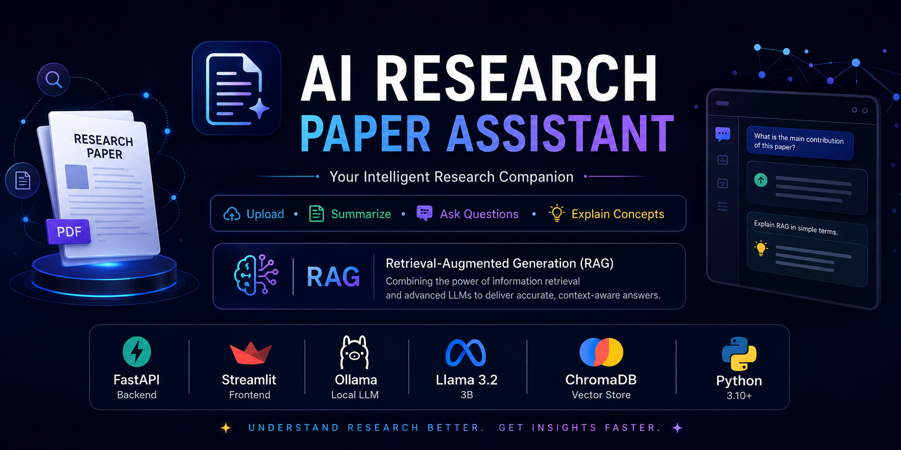
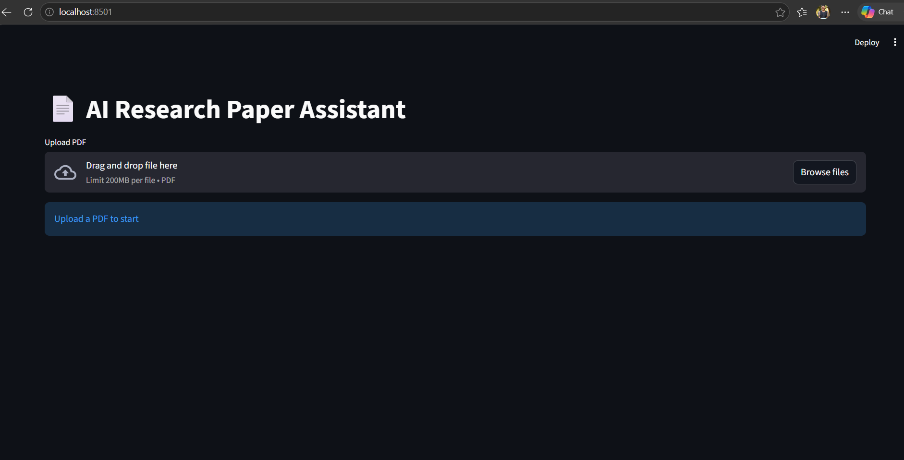
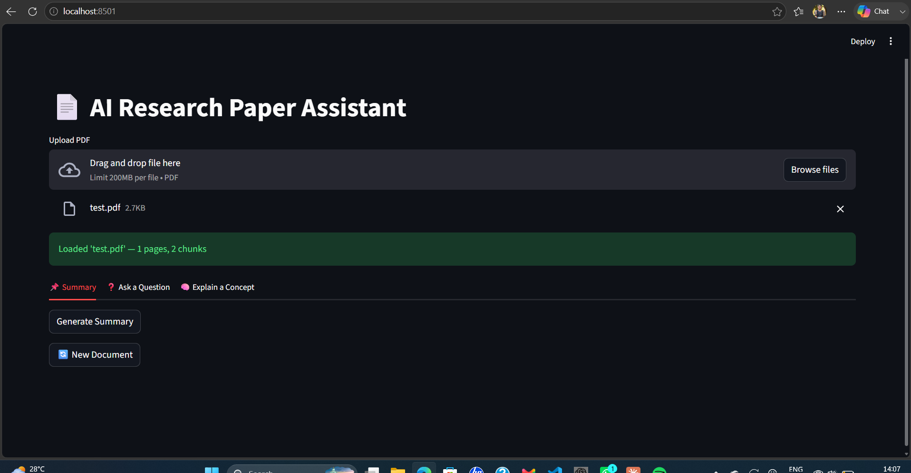
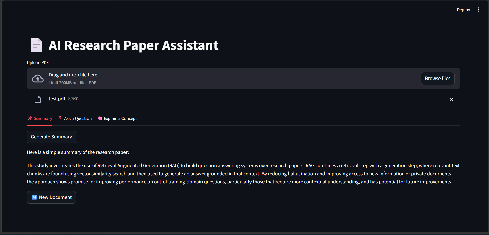
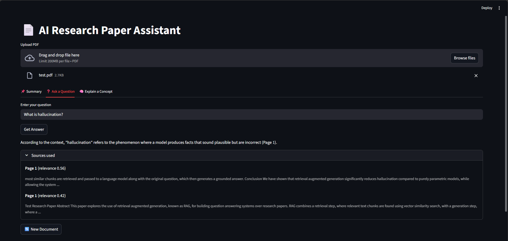

<p align="center">
  
</p>


# 📚 AI Research Paper Assistant

<p align="center">

# 🤖 AI-Powered Research Paper Understanding using RAG

### Retrieval-Augmented Generation (RAG) • FastAPI • Streamlit • Ollama • ChromaDB

</p>

<p align="center">


</p>

<p align="center">

**Default LLM:** `llama3.2:3b`  
**Embedding Model:** `nomic-embed-text`

</p>

---

# 🌟 Overview

AI Research Paper Assistant is a **Retrieval-Augmented Generation (RAG)** application that enables users to interact with research papers using natural language.

Simply upload a research paper PDF and the assistant can:

- 📄 Generate concise summaries
- 💬 Answer questions from the document
- 💡 Explain difficult concepts in simple language
- 🧠 Maintain conversation history
- 🔍 Retrieve relevant information using semantic search

Unlike a traditional chatbot, every response is generated using the uploaded document, making answers more accurate and context-aware.

---

# ✨ Features

| Feature | Description |
|----------|-------------|
| 📄 PDF Upload | Upload research papers in PDF format |
| 📝 AI Summary | Generate concise summaries of research papers |
| 💬 Question Answering | Ask questions about the uploaded document |
| 💡 Concept Explanation | Explain complex concepts in simple language |
| 🧠 Conversation Memory | Maintains previous conversation context |
| 🔍 Semantic Search | Retrieves the most relevant document chunks |
| 📚 ChromaDB | Stores embeddings for efficient retrieval |
| ⚡ Local LLM | Runs locally using Ollama |

---

# 📸 Screenshots

## 🏠 Home Screen

<p align="center">

</p>

---

## 📄 Upload Research Paper

<p align="center">

</p>

---

## 📝 AI Generated Summary

<p align="center">

</p>

---

## 💬 Ask Questions

<p align="center">

</p>

---

## 💡 Explain a Concept

<p align="center">

</p>

---

# 🏗️ System Architecture

```text
                     User
                      │
                      ▼
             Streamlit Frontend
                      │
                      ▼
              FastAPI Backend
                      │
                      ▼
             Document Processing
                      │
                      ▼
               Text Extraction
                      │
                      ▼
                Text Chunking
                      │
                      ▼
      Embedding Generation (nomic-embed-text)
                      │
                      ▼
              ChromaDB Vector Store
                      │
                      ▼
              Semantic Retrieval
                      │
                      ▼
             Prompt Construction
                      │
                      ▼
      Ollama (llama3.2:3b LLM)
                      │
                      ▼
             AI Generated Response
```

---

# ⚙️ How It Works

### 📄 Step 1 – Upload PDF

The user uploads a research paper in PDF format.

⬇️

### 📑 Step 2 – Extract Text

The application extracts text from every page of the PDF.

⬇️

### ✂️ Step 3 – Chunking

The extracted text is divided into smaller overlapping chunks for efficient retrieval.

⬇️

### 🔢 Step 4 – Generate Embeddings

Each chunk is converted into vector embeddings using:

- **nomic-embed-text**

⬇️

### 🗄️ Step 5 – Store in ChromaDB

The embeddings are stored in **ChromaDB**, enabling fast semantic search.

⬇️

### 🔍 Step 6 – Retrieve Relevant Chunks

When a user asks a question or requests a summary, the system retrieves the most relevant chunks from ChromaDB.

⬇️

### 🤖 Step 7 – Generate Response

The retrieved context is combined with the user's prompt and sent to:

**llama3.2:3b (Ollama)**

to generate an accurate, document-grounded response.

---

# 🛠️ Tech Stack

| Category | Technology |
|-----------|------------|
| Programming Language | Python |
| Backend | FastAPI |
| Frontend | Streamlit |
| LLM | Ollama (llama3.2:3b) |
| Embedding Model | nomic-embed-text |
| Vector Database | ChromaDB |
| PDF Processing | PyPDF |
| AI Technique | Retrieval-Augmented Generation (RAG) |

---

# 📂 Project Structure

```text
research-paper-rag-assistant
│
├── backend
│   ├── api
│   ├── services
│   ├── models
│   ├── utils
│   ├── config.py
│   └── main.py
│
├── frontend
│   └── app.py
│
├── chroma_db
│
├── docs
│   ├── home.png
│   ├── upload.png
│   ├── summary.png
│   ├── chat.png
│   └── explain.png
│
├── README.md
│
└── requirements.txt
```

---

# 🚀 Getting Started

## 1. Clone the Repository

```bash
git clone https://github.com/Sharanya185/research-paper-rag-assistant.git

cd research-paper-rag-assistant
```

---

## 2. Create a Virtual Environment

```bash
python -m venv venv

venv\Scripts\activate
```

---

## 3. Install Dependencies

```bash
pip install -r backend/requirements.txt

pip install -r frontend/requirements.txt
```

---

## 4. Install Ollama Models

```bash
ollama pull llama3.2:3b

ollama pull nomic-embed-text
```

---

## 5. Run Backend

```bash
python -m uvicorn backend.main:app --reload
```

Backend runs at:

```text
http://127.0.0.1:8000
```

---

## 6. Run Frontend

Open another terminal.

```bash
cd frontend

streamlit run app.py
```

Frontend runs at:

```text
http://localhost:8501
```

---

# 🚀 Future Improvements

- 📑 Support multiple research papers
- 🎤 Voice-based interaction
- 📚 Automatic citation generation
- 📊 Research paper comparison
- 🌐 Docker support
- ☁️ Cloud deployment
- 📈 Improved retrieval using reranking models

---

# 👩‍💻 Author

## **Sharanya Rai K**

🎓 Artificial Intelligence & Machine Learning Engineering Student

### Interests

- Artificial Intelligence
- Large Language Models (LLMs)
- Retrieval-Augmented Generation (RAG)
- Generative AI
- Machine Learning
- Deep Learning

GitHub: **https://github.com/Sharanya185**

---


